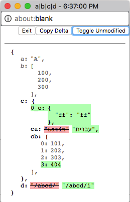

jsdiff
---
Chrome devtools extension
intended to display result of in-memory object comparisons with
the help of dedicated commands invoked via console.

Example
===
```javascript
console.diff(left, right);
console.diffLeft(left);
console.diffRight(right);
```


Based on 
===
[jsondiffpatch](https://github.com/benjamine/jsondiffpatch) by benjamine
