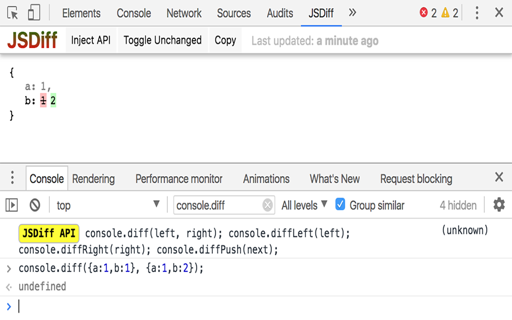

jsdiff
---
Chrome devtools extension
intended to display result of in-memory object comparisons with
the help of dedicated commands invoked via console.

Example
===
```javascript
console.diff(left, right);
console.diffLeft(left);
console.diffRight(right);
console.diffPush(next); // private case of console.diff with single argument
```


Usage basics
===
Left side for old state, right side for new.
To track changes of the same object in timed manner you can push it with `diffPush` command, 
that will shift objects from right to left, showing differences with previous push state. 

Based on 
===
[jsondiffpatch](https://github.com/benjamine/jsondiffpatch) by benjamine
