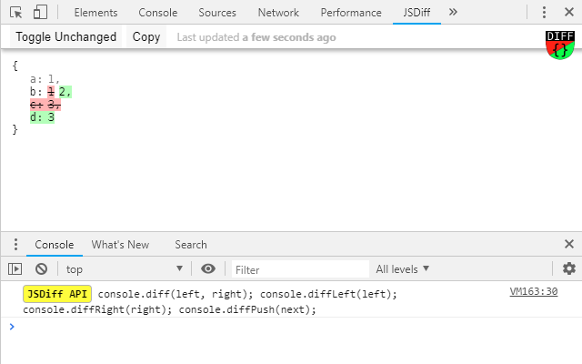

 [available at chrome web-store](https://chrome.google.com/webstore/detail/jsdiff-devtool/iefeamoljhdcpigpnpggeiiabpnpgonb)
---
Chrome devtools extension intended to display result of deep in-memory object
comparisons with the help of dedicated console commands.


### API
```javascript
console.diff(left, right);  // compare left and right
console.diff(next);         // shorthand of diffPush while single argumented
console.diffLeft(left);     // update object on the left side only
console.diffRight(right);   // update object on the right side only
console.diffPush(next);     // shifts sides, right becomes left, next becomes right
```


### Usage basics
Historicly, left side represents the old state and right side the new state.
Things that are present on the left side but missing on the right side are colour-coded as red (old).
Things that are missing on the left side but present on the right side are colour-coded as green (new).
To track changes of the same variable in timed manner you can push it with `diffPush` command,
that will shift objects from right to left, showing differences with previous push state.
You can compare objects from different tabs (sites).


### Screenshot



### Gotcha
Comparred objects shouldn't contain functions or self-recurrent references, like DOM elements or view instances have.


### Based on
- [jsondiffpatch](https://github.com/benjamine/jsondiffpatch) by Benjamín Eidelman
- [vuejs](https://github.com/vuejs) by Evan You
