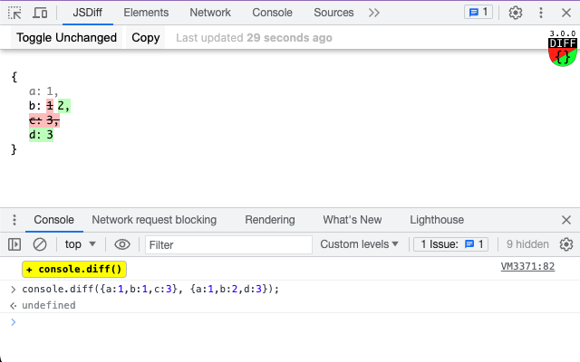

###  console.diff()

[](https://chrome.google.com/webstore/detail/jsdiff-devtool/iefeamoljhdcpigpnpggeiiabpnpgonb)

Chrome extension to compare objects in memory with console.diff(old, new) devtools function.

<details>
  <summary> <strong>Screenshots</strong> </summary>

- Comparing two objects
  

- Tracking changes in localStorage (unchanged are hidden)
  

</details>

### Based on

- [jsondiffpatch](https://github.com/benjamine/jsondiffpatch) by Benjamín Eidelman
- [vuejs](https://github.com/vuejs) by Evan You

### Features

- Compare objects between multiple [sub]domains, chrome tabs, or single page reloads.
- Function code included in comparison result in form of a string, combined from a function name (if declared) and a SHA-256 function body hash; so it may help to detect if it was altered. Native functions delcared as silmply as `ƒ(native)`.
- Unserializable objects, like Document or Elements, are serialized as `0x####: unserializable`.
- Self recurring references displayed only once, and the rest of ocurrences are mentioned with object reference like `0x####: ...`.
- Basic integration with search functionality within devtools:
  - if search query contains upper-case letter - the search will be case-sensitive.
- Serialization of Set, Map, +/-Infinity, NaN, BigInt, Symbols and proper serialization of `undefined` values.
- Failsafe serialization of objects having security issues accessing their props.
- Failsefe serialization of objects having `toJSON()` function (instead of serialization of all object properties, - only toJSON() return value are serialized, similar to the way JSON.strigify() works)

### Limitations and workarounds

- Some instances of objects may cause exception during preparations for comparison
  - Try to narrow compared contexts
  - If it's some Browser API that causes an exception and not a framework, consider opening an issue, so it will be possible to solve it on a permanent basis
- While paused in debug mode, JSDiff panel won't reflect the result until runtime is resumed ([#10][i10])
- Compared objects, after being serialized, are stored in `chrome.storage.local` wich has 10MB limit, so if you see `QUOTA_BYTES quota exceeded` error message - this is it.

[i10]: https://github.com/zendive/jsdiff/issues/10

### API

- **console.diff(left, right)** - compare left and right arguments

```javascript
console.diff({ a: 1, b: 1, c: 3 }, { a: 1, b: 2, d: 3 });
```

- **console.diffPush(next)** - shifts sides, right becomes left, next becomes right

```javascript
console.diffPush(Date.now());
```

- **console.diff(next)** - shorthand for `diffPush`

```javascript
console.diff(Date.now());
```

- **console.diffLeft(left)** - update the old value only

```javascript
console.diffLeft(Date.now());
```

- **console.diffRight(right)** - update the new value only

```javascript
console.diffRight(Date.now());
```

- **console.diff\_(\*)** - deprecated, left for backward compatibility, uses `nativeClone` based of JSON.parse(JSON.stringify(...)) serialization method

### Usage basics

Historically, left side represents the old state and right side the new state.

- Things that are present on the left side but missing on the right side are colour-coded as red (old).
- Things that are missing on the left side but present on the right side are colour-coded as green (new).
- To track changes of the same variable in timed manner you can push it with `diffPush` or `diff` with a single argument, - that will shift objects from right to left, showing differences with previous push state.

### How it works

- `manifest.json` injects content scripts to each visited site (except for chrome web store site and google-protected alike):
  - `jsdiff-console.ts` as [MAIN world](https://developer.chrome.com/docs/extensions/reference/scripting/#type-ExecutionWorld), - to have access to the target site memory
    - sends messages to `jsdiff-proxy.ts`.
  - `jsdiff-proxy.ts` as `ISOLATED` world (has access to chrome runtime)
    - stores data from `jsdiff-console.ts` in `chrome.storage.local` and sends runtime messages to `panel.vue`.
- `jsdiff-devtools.ts` registers `panel.vue` as a JSDiff devtools panel that reads current state of `chorme.storage.local` and listens to incomming `chrome.runtime` mesages from `jsdiff-proxy.ts`.

### How to build

- requires nodejs
- requires pnpm `npm i -g pnpm`

```sh
pnpm i
pnpm dev # local development
pnpm zip # make extension.zip
```
