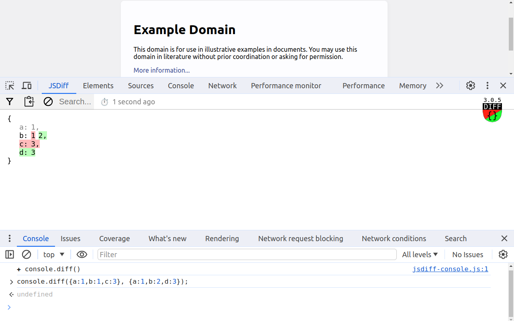

###  JSDiff

An extension for developers that enhances the console API by incorporating the ability to compare objects and adds a `JSDiff` tab (parallel to Elements, Network panels) within your dev-tools for viewing the results.

- Available in Chrome Web Store as [console.diff()](https://chromewebstore.google.com/detail/consolediff/iefeamoljhdcpigpnpggeiiabpnpgonb)
- Available in Firefox Add-ons as [jsdiff.diff()](https://addons.mozilla.org/addon/jsdiff-diff/)

<details>
  <summary> <strong>Examples</strong> </summary>

- Comparing two objects
  

- Tracking changes in `localStorage` (unchanged are hidden)
  

</details>
<details>
  <summary> <strong>How it works</strong> </summary>

- Chrome mv3
  
- Firefox
  

</details>

### Based on

- [jsondiffpatch](https://github.com/benjamine/jsondiffpatch) by Benjamín Eidelman
- [vuejs](https://github.com/vuejs) by Evan You

### Features

- User interface:

  - Buttons:
    - hide / show unchanged properties.
    - Copy changed properties in format of `jsondiffpatch` Delta object.
    - Clear current result.
  - Search input to highlight patterns.
  - Indicator of the last update time.
  - Indicator of a fatal error (out of storage memory).
  - DevTools light/dark color scheme support.

- Compare objects between multiple [sub]domains, Chrome tabs, or single page reloads.

  - `JSDiff` DevTools panel reflects current state of comparison, regardless the tab[s] it was opened from.

- Internal search inside comparison results

  - If search query contains at least one upper-case letter - the search will be case-sensitive.

- Using `console.diff` functions from within online code editors like: [codesandbox.io](https://codesandbox.io), [coderpad.io](https://coderpad.io), [flems.io](https://flems.io), [codepen.io](https://codepen.io), [jsfiddle.net](https://jsfiddle.net), [mdn playground](https://developer.mozilla.org/play).

- Functions are included in comparison result in order to detect possible alterations, in form of a string combined from a function name (if present) and a hash of a `function.toString()` body. Native functions are shown as `ƒ⟪native⟫`.

- Some DOM objects like `Document` or `Element` are not worth to be shown entirely, since that is not the purpose of this extension. So if they are present anywhere, they are serialized as `0x####: DOM⟪nodeName⟫`.

- `Object`, `Array`, `Map`, `Set` - serialized only once and the rest of their occurrences are mentioned with unique reference like: `0x####: {♻️}`, `0x####: [♻️]`, `0x####: Map{♻️}`, `0x####: Set[♻️]` respectively.

  - `Map` keys, unless they are primitive types, serialized by their pseudo ids.
  - Keys like `0` and `'0'` would be merged due to `Map to Object` conversion.

- Unique `Symbol` serialized with his pseudo `id` like: `0x####: Symbol(name)`.

- Global `Symbol` (registered like `Symbol.for('example')`) serialized just by its name: `Symbol(example)`.

- `RegExp` serialized as `RegExp⟪/example/i⟫`.

- `URL` serialized as `URL⟪https://example.com/⟫`.

- Serialization of numerics like `±Infinity`, `NaN`, `BigInt`, or `undefined` serialized like: `Number⟪±Infinity⟫`, `Number⟪NaN⟫`, `BigInt⟪#⟫`, `⟪undefined⟫` respectively.

- Fail-safe serialization of objects having security issues while accessing their properties.

- Fail-safe serialization of objects having `toJSON()` function (when instead of serialization of all object properties, - only `toJSON()` return value is serialized, similar to the way native `JSON.strigify()` works).

### Legend

- Pseudo `id`, assigned to non-primitive data types, used in order to detect reference recurrences and, in case of Symbols - symbol uniqueness. `id` for an object shown in the output only if it had been seen more than once. It's being assigned in the scope of serialization of a high level argument instance, while comparing left or right side; that means - if some object, having `id` of 0x0001 on the left side, is not guarantied to have same `id` on the right side.

### Limitations

- While paused in debug mode, `JSDiff` panel won't reflect the result until runtime is resumed (see [#10][i10]).

[i10]: https://github.com/zendive/jsdiff/issues/10

- Compared objects, after being serialized, stored in `chrome.storage.local` which has 10 MB limit.

- In Firefox the API is under `jsdiff` object for now, cause extension API's not fully compatible.

### API

- **console.diff(left, right)** - compare left and right arguments

```javascript
console.diff({ a: 1, b: 1, c: 3 }, { a: 1, b: 2, d: 3 });
```

- **console.diffPush(next)** - shifts sides, right becomes left, next becomes right

```javascript
console.diffPush(Date.now());
```

- **console.diff(next)** - shorthand for `diffPush`

```javascript
console.diff(Date.now());
```

- **console.diffLeft(left)** - update the old value only

```javascript
console.diffLeft(Date.now());
```

- **console.diffRight(right)** - update the new value only

```javascript
console.diffRight(Date.now());
```

### Typescript

Global Console interface declaration for quick copy/paste when used from typescript:

```typescript
declare global {
  interface Console {
    diff(left: unknown, right?: unknown): void;
    diffPush(next: unknown): void;
    diffLeft(left: unknown): void;
    diffRight(right: unknown): void;
  }
}
```

### Usage basics

Historically, left side represents the old state and right side the new state.

- Things that are present on the left side and missing on the right side are color-coded as red (old).

- Things that are missing on the left side and present on the right side are color-coded as green (new).

- To track changes of the same variable in timed manner you can push it with `diffPush` or `diff` with a single argument, - that will shift objects from right to left, showing differences with previous push state.

### Build instructions

- Linux
- node 22.14 (LTS)

```sh
make install      # install dependencies
make all          # build for prod and make extension.${browser}.zip
make tune2chrome  # or tune2firefox for relevant manifest.json file
make dev          # local development
```

### Protection

- How to protect your site from this extension:

  - Well, tests in Chrome show that even `Content-Security-Policy: default-src 'none';` header won't prevent injection of extension content-scripts...

  - Avoid assigning to `window` or `globalThis` any application object.
    See also [accidental global variables and memory leaks](https://www.tutorialspoint.com/explain-in-detail-about-memory-leaks-in-javascript).

  - In general, you can incapacitate console functions:

  ```js
  for (const prop in console) {
    if (typeof console[prop] === 'function' && prop !== 'error') {
      console[prop] = function noop() {};
    }
  }
  ```
